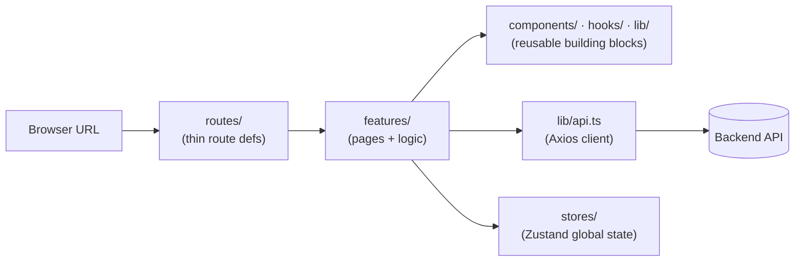

# AlphaDashboard Documentation

Reference docs for the AlphaDashboard template — a reusable React admin frontend
built on Vite, React 19, TypeScript, Tailwind v4 and Radix-based UI
primitives.

## Start here

| I want to… | Read |
| --- | --- |
| Get it running | [getting-started.md](./getting-started.md) |
| Understand how it is organised | [architecture.md](./architecture.md) |
| See the flows drawn out | [diagrams/](./diagrams/README.md) |
| Write a screen that matches the others | [conventions.md](./conventions.md) |
| Add a feature, step by step | [adding-a-feature.md](./adding-a-feature.md) |
| Make it my project | [customizing.md](./customizing.md) |
| Run or write tests | [testing.md](./testing.md) |
| Ship it | [deployment.md](./deployment.md) |
| Know why these libraries | [tech-stack.md](./tech-stack.md) |

**New to the repo?** getting-started → architecture → conventions, in that
order. The first gets you a running app with data, the second explains where
things live, the third is what you keep open while writing code.

## The 30-second mental model

- **`routes/`** maps URLs to pages (file-based). Thin — it wires a route to a
  feature and guards it.
- **`features/`** holds the screens and their logic, one folder per feature.
- **`components/`, `hooks/`, `lib/`** are the shared building blocks.
- **`lib/api.ts`** is the single door to the backend; **`stores/`** holds global
  client state.

## Keeping these docs honest

Two rules, because an earlier version of this doc set went stale within a single
session's work — describing deleted components as though they still existed, and
telling readers to hand-roll a table the shared component exists to prevent.

**1. Code owns the "why".** The most important explanations live in docblocks
next to the code they describe — `sidebar-data.ts` on navigation tiers,
`lookup-config.ts` on the lookup escape hatch, `dialog-body.tsx` on why it does
not use Radix `ScrollArea`, `subject-types.ts` on why a typo there fails
silently. Docs **link** to those rather than restating them, because restating
is what rots.

**2. `pnpm docs:check` enforces the rest.** It fails when any doc references a
file that no longer exists — a link, a code span, or a path in an ASCII diagram.
It runs in CI. It would have caught every dangling reference the audit found.

It cannot tell you a *description* went stale. That still needs a human, which
is why the [adding-a-feature checklist](./adding-a-feature.md#checklist) ends
with "update the docs in the same commit".
