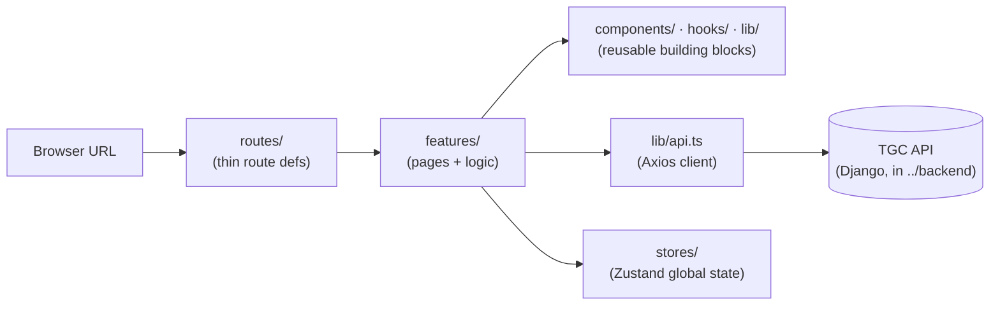

# TGC Service Frontend — Documentation

Reference docs for the web client of the Tanzania Gemmological Centre's
stone-certification system, built on Vite, React 19, TypeScript, Tailwind v4 and
Radix-based UI primitives.

## Start here

| I want to… | Read |
| --- | --- |
| Get it running | [getting-started.md](./getting-started.md) |
| Understand how it is organised | [architecture.md](./architecture.md) |
| See the flows drawn out | [diagrams/](./diagrams/README.md) |
| Write a screen that matches the others | [conventions.md](./conventions.md) |
| Add a feature, step by step | [adding-a-feature.md](./adding-a-feature.md) |
| Change branding, navigation or theme | [customizing.md](./customizing.md) |
| Look up a colour or a design token | [TGC-COLOR-SYSTEM.md](./TGC-COLOR-SYSTEM.md) |
| Run or write tests | [testing.md](./testing.md) |
| Ship it | [deployment.md](./deployment.md) |
| Know why these libraries | [tech-stack.md](./tech-stack.md) |

**New to the repo?** getting-started → architecture → conventions, in that
order. The first gets you a running app with data, the second explains where
things live, the third is what you keep open while writing code.

## The 30-second mental model

```mermaid
flowchart LR
    URL["Browser URL"] --> Routes["routes/<br/>(thin route defs)"]
    Routes --> Features["features/<br/>(pages + logic)"]
    Features --> Shared["components/ · hooks/ · lib/<br/>(reusable building blocks)"]
    Features --> API["lib/api.ts<br/>(Axios client)"]
    API --> Backend[("TGC API<br/>(Django, in ../backend)")]
    Features --> Stores["stores/<br/>(Zustand global state)"]
```

- **`routes/`** maps URLs to pages (file-based). Thin — it wires a route to a
  feature and guards it.
- **`features/`** holds the screens and their logic, one folder per feature.
- **`components/`, `hooks/`, `lib/`** are the shared building blocks.
- **`lib/api.ts`** is the single door to the backend; **`stores/`** holds global
  client state.

## Maintaining documentation

Keep detailed implementation contracts beside the code that owns them, and
link to those explanations from broader guides. When behavior or structure
changes, update the relevant guide and examples in the same change. The
[adding-a-feature checklist](./adding-a-feature.md#checklist) includes this
review.

`pnpm docs:check` verifies that documented paths resolve. GitHub Actions runs
frontend checks on pushes to `main`/`master` and pull requests. The backend has
its own link checker and CI workflow; each checker covers its repository.
