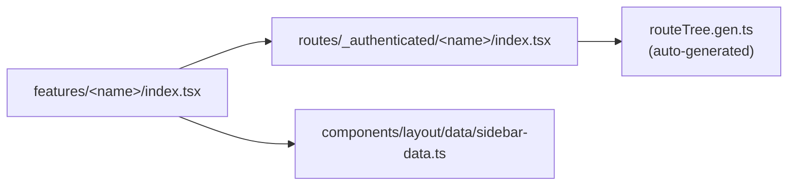
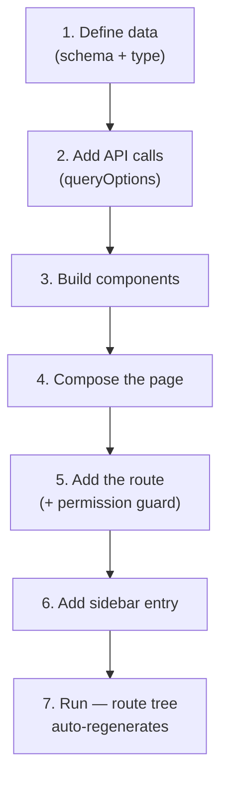

# Adding a Feature

A step-by-step guide to adding a new feature (a screen/module). It follows the
reference feature, [`src/features/products/`](../src/features/products) — copy
that folder when in doubt.

> Background: read [architecture.md](./architecture.md) first if you're unsure
> how `routes/` and `features/` relate.

## The shape of a feature

```
features/<name>/
├── index.tsx        Page component (composes header + content)
├── components/       Components used only by this feature
└── data/             Zod schema, types and API calls
```

And it's wired into the app in three places:



## The steps at a glance



---

## Step 0 — does this need a feature at all?

If your resource is reference data — `name`, `description`, `is_active`, soft
deletes, restore — **stop**. Add one entry to `lookupConfigs` in
[`src/features/lookups/data/lookup-config.ts`](../src/features/lookups/data/lookup-config.ts)
and you get a table, CRUD, soft-delete/restore, permission gating and audit
history with no new components.

Five screens already work this way. The instinct to copy `features/products/`
for a table of tags costs a folder of code that then has to be maintained
separately. Only continue below if your resource genuinely needs its own
screen.

## Walkthrough

We'll use a `Widget` resource served at `/widgets`. Swap the noun for your own.

### 1. Define the data — `data/schema.ts`

Describe the API response with Zod; the TypeScript type is *inferred*, so schema
and type can never drift apart.

```ts
// src/features/widgets/data/schema.ts
import { z } from 'zod'

export const widgetSchema = z.object({
  id: z.number(),
  name: z.string(),
  // Laravel casts decimals to strings; coerce once, here at the boundary.
  price: z.coerce.number(),
  is_active: z.boolean().default(true),
})

export type Widget = z.infer<typeof widgetSchema>
```

### 2. Add the API calls — `data/widgets-api.ts`

Use the shared `api` client (never raw `axios`) so the base URL, auth header and
401-refresh all apply. Lists are **paginated by the server**, so use
`buildListParams` to translate table state into the API's query contract.

```ts
// src/features/widgets/data/widgets-api.ts
import { queryOptions } from '@tanstack/react-query'
import { z } from 'zod'
import { api } from '@/lib/api'
import { buildListParams, metaSchema, type ListParams } from '@/lib/api-query'
import { widgetSchema, type Widget } from './schema'

// A literal key (not a generic helper) keeps TypeScript inference intact.
const listSchema = z.object({
  widgets: z.array(widgetSchema),
  meta: metaSchema,
})

export async function fetchWidgets(params: ListParams) {
  const res = await api.get('/widgets', { params: buildListParams(params) })
  const parsed = listSchema.parse(res.data)
  return { items: parsed.widgets, meta: parsed.meta }
}

export const widgetsQueryOptions = (params: ListParams) =>
  queryOptions({
    queryKey: ['widgets', params],
    queryFn: () => fetchWidgets(params),
    // Keeps the previous page on screen while the next one loads.
    placeholderData: (previous) => previous,
  })
```

> **Why `queryOptions`?** The same definition works with `useQuery` in a
> component *and* `ensureQueryData` in a route loader — one source of truth for
> the query key and fetcher.

**Writes with a file** must be `multipart/form-data`, and PHP does not parse
multipart on `PUT` — so updates POST with `_method=PUT`. See `toFormData()` in
[`products-api.ts`](../src/features/products/data/products-api.ts).

### 3. Build feature components — `components/`

Keep feature-only components in the feature folder. The response envelope is
always:

```json
{ "widgets": [ ... ], "links": { ... }, "meta": { "current_page": 1, "last_page": 9, "per_page": 10, "total": 84 } }
```

**Do not write your own table.** `<DataTable>` already owns the `manual*` flags,
the serial-number column, the row-click guard and the deleted-row styling — the
whole reason it was extracted is that hand-rolled tables drift from each other.
Your table component supplies columns, state and a toolbar:

```tsx
// components/widgets-table.tsx
export function WidgetsTable({ data, meta, isFetching, state, onStateChange, onRowClick }) {
  return (
    <DataTable
      columns={widgetsColumns}
      data={data}
      meta={meta}
      isFetching={isFetching}
      state={state}
      onStateChange={onStateChange}
      onRowClick={onRowClick}
      isRowDeleted={(widget) => Boolean(widget.deleted_at)}
      toolbar={toolbar}
      emptyMessage='No widgets found.'
    />
  )
}
```

Six columns: the serial number (injected for you), four data columns, and
actions. Declare the actions as data rather than JSX — they are rendered twice,
as icon buttons in the cell and as labelled buttons in the view dialog, so build
them in a hook both can call:

```tsx
// components/use-widget-actions.ts
const actions: RowAction[] = [
  { label: 'View', icon: Eye, permission: 'widgets.view', onSelect: () => select('view') },
  { label: 'Edit', icon: Pencil, permission: 'widgets.update', onSelect: () => select('update'), hidden: isDeleted },
  { label: 'Delete', icon: Trash2, permission: 'widgets.delete', onSelect: () => select('delete'), variant: 'destructive', hidden: isDeleted, separatorBefore: true },
]

return <DataTableRowActions actions={actions} />
```

Then hand the same list to the view dialog as `actions`, so everything you can
do from the row you can also do while looking at the record.

**There is no separate view component.** Give your mutate dialog a `readOnly`
prop and wrap its body in one disabled `<fieldset>`; clicking a row opens the
same dialog it edits with, so the two cannot drift.

All of this is spelled out with the reasoning in
[conventions.md](./conventions.md) — worth reading once before your first
screen.

### 4. Compose the page — `index.tsx`

The page reads table state from the URL, runs the query, and handles the error
state explicitly.

```tsx
const search = route.useSearch()
const { data, isPending, isError, isFetching } = useQuery(
  widgetsQueryOptions({ page: search.page ?? 1, perPage: search.pageSize ?? 10 })
)
```

Gate write actions with `<Can>`:

```tsx
<Can permission='widgets.create'>
  <Button onClick={openCreate}>Add widget</Button>
</Can>
```

One dialog serves view, create and edit:

```tsx
<WidgetMutateDialog
  key={currentRow ? `widget-${currentRow.id}` : 'create'}
  open={open === 'view' || open === 'create' || open === 'update'}
  currentRow={open === 'create' ? null : currentRow}
  readOnly={open === 'view'}
  onRequestEdit={() => setOpen('update')}
  onOpenChange={(isOpen) => !isOpen && setOpen(null)}
/>
```

### 5. Add the route — `routes/_authenticated/<name>/index.tsx`

Put it under `_authenticated/` so it inherits the auth guard and app shell, and
add a permission guard so a direct URL cannot bypass the hidden nav entry.

```tsx
import { createFileRoute } from '@tanstack/react-router'
import z from 'zod'
import { requirePermission } from '@/lib/authz'
import { Widgets } from '@/features/widgets'

// Table state lives in the URL so views are shareable and survive a refresh.
const widgetsSearchSchema = z.object({
  page: z.number().optional().catch(1),
  pageSize: z.number().optional().catch(10),
  search: z.string().optional().catch(''),
  sortBy: z.string().optional().catch(undefined),
  sortDir: z.enum(['asc', 'desc']).optional().catch(undefined),
})

export const Route = createFileRoute('/_authenticated/widgets/')({
  beforeLoad: requirePermission(['widgets.viewAny']),
  validateSearch: widgetsSearchSchema,
  component: Widgets,
})
```

The file path **is** the URL: this route serves `/widgets`.

### 6. Add the sidebar entry — `sidebar-data.ts`

```ts
import { Boxes } from 'lucide-react'
// …inside navGroups → General → items:
{ title: 'Widgets', url: '/widgets', icon: Boxes, permission: 'widgets.viewAny' },
```

The `permission` field filters both the sidebar and the ⌘K command palette, so
navigation never offers a page that would immediately 403.

### 7. Run it

```bash
pnpm dev
```

`routeTree.gen.ts` regenerates automatically — **never edit it by hand.**

---

## Variations

### A static feature (no data fetching)

Skip steps 1–2. Create `index.tsx` and wire the route + sidebar entry. For a
placeholder, reuse [`ComingSoon`](../src/components/coming-soon.tsx).

### A feature with a form

React Hook Form + Zod, with server errors mapped back onto the fields:

```tsx
if (error instanceof AxiosError && error.response?.status === 422) {
  for (const [field, messages] of Object.entries(error.response.data.errors)) {
    form.setError(field, { message: messages[0] })
  }
}
```

Full example:
[`product-mutate-dialog.tsx`](../src/features/products/components/product-mutate-dialog.tsx).

### File uploads

See [`product-gallery.tsx`](../src/features/products/components/product-gallery.tsx)
for multi-file upload, set-primary and delete against the API.

---

## Checklist

- [ ] Confirmed this is not a lookup (step 0)
- [ ] `features/<name>/data/schema.ts` — Zod schema + inferred type
- [ ] `features/<name>/data/<name>-api.ts` — fetchers + `queryOptions`
- [ ] `features/<name>/components/` — uses `<DataTable>` and `RowAction[]`
- [ ] View reuses the mutate dialog with `readOnly`
- [ ] `features/<name>/index.tsx` — page with error/empty handling
- [ ] `routes/_authenticated/<name>/index.tsx` — thin route + `requirePermission`
- [ ] `sidebar-data.ts` — nav entry with `permission` and a lucide icon
- [ ] `lib/subject-types.ts` entry, if the record should have history
- [ ] A test for anything non-obvious — see [testing.md](./testing.md)
- [ ] Docs updated in the same commit, if you changed a shared component
- [ ] `pnpm typecheck`, `pnpm lint`, `pnpm knip` and `pnpm docs:check` pass
- [ ] Signed in as `viewer@test.com` — the row menu collapses to View
