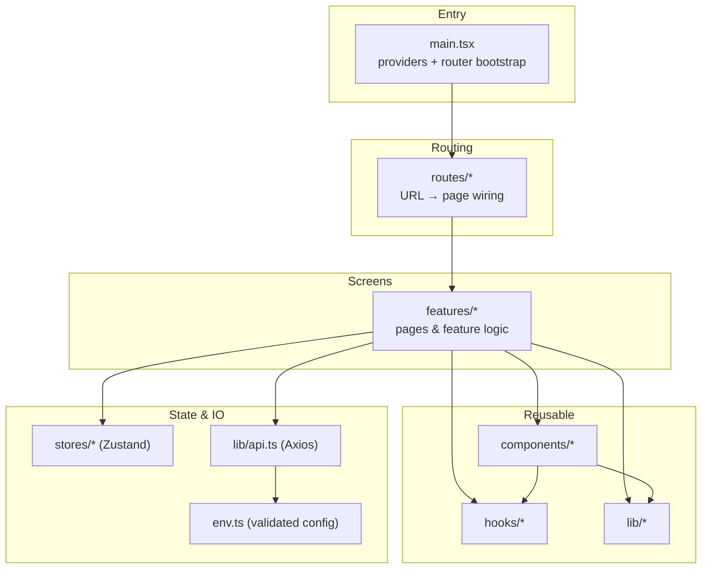
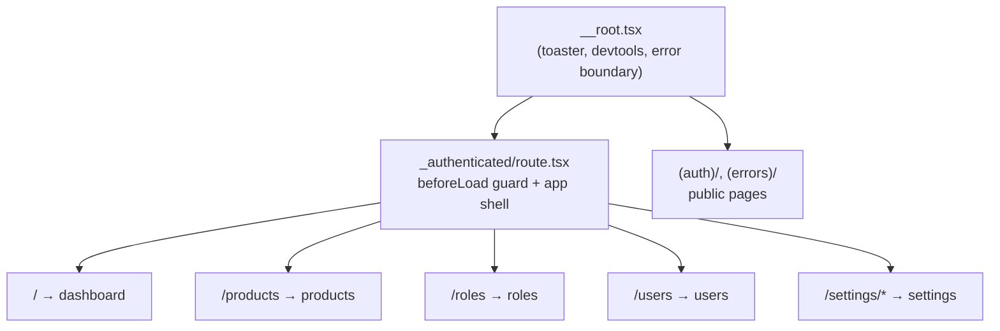
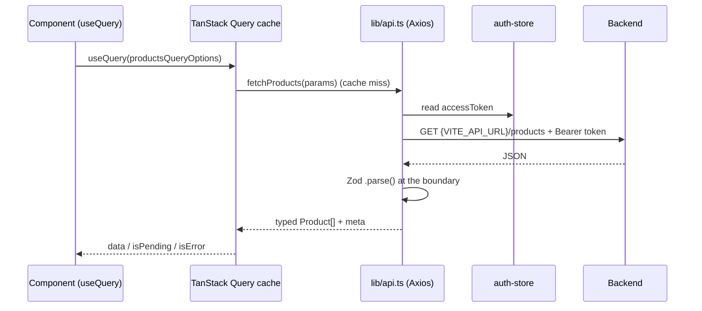
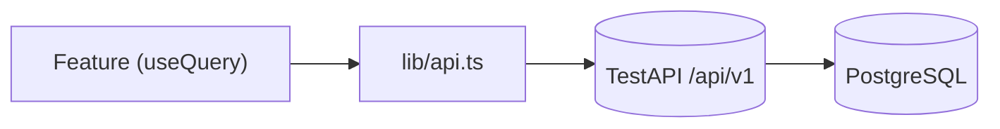

# Architecture

> Detailed flowcharts of each flow described here live in
> [diagrams/](./diagrams/README.md).

How the project is organized, what each directory is for, and how the pieces
talk to each other.

## Layered overview

The app is organized in layers. Higher layers depend on lower ones, never the
reverse — a `lib/` utility never imports a `feature`, but a feature freely uses
`lib/`, `components/`, and `hooks/`.



## Directory map

```
src/
├── main.tsx              App entry: builds the QueryClient + Router, mounts providers
├── env.ts               Zod-validated environment variables (fail-fast at startup)
├── routeTree.gen.ts     AUTO-GENERATED route tree — never edit by hand
├── vite-env.d.ts        Vite type shims
├── tanstack-table.d.ts  Type augmentation for TanStack Table column metadata
│
├── assets/              Static SVG/TSX icons and logos
│   ├── brand-icons/       Social/brand logos (GitHub, Facebook) used by auth forms
│   └── custom/            App-specific icons (layout, theme, sidebar variants)
│
├── config/
│   └── app-config.ts     Central branding (name, description, url) — single rebrand point
│
├── context/            React context providers, mounted globally in main.tsx / layout
│   ├── theme-provider.tsx      Light/dark/system theme
│   ├── font-provider.tsx       Font family selection
│   ├── direction-provider.tsx  LTR/RTL text direction
│   ├── layout-provider.tsx     Sidebar variant/collapse state
│   └── search-provider.tsx     Global command-menu (⌘K) search state
│
├── stores/
│   └── auth-store.ts     Zustand store for auth state (user + token, cookie-backed)
│
├── lib/                Framework-agnostic utilities and IO
│   ├── api.ts            Axios client: base URL, auth header, single-flight 401 refresh
│   ├── api-query.ts      Maps table state to the API's query-parameter contract
│   ├── authz.ts          RBAC helpers (`hasAnyPermission`, `requirePermission` guard)
│   ├── utils.ts          `cn()` classname merge, `sleep()`, misc helpers
│   ├── cookies.ts        Typed cookie get/set/remove
│   ├── format.ts         Locale/timezone/currency — the ONLY money+date formatter
│   ├── subject-types.ts  Backend class names for audit history lookups
│   ├── handle-server-error.ts  Normalizes API errors into user-facing toasts
│   └── show-submitted-data.tsx Dev helper used by the unfinished settings forms
│
│
├── test-utils/         Helpers shared by tests
│
├── hooks/              Reusable React hooks
│   ├── use-mobile.tsx          Media-query hook for responsive behavior
│   ├── use-dialog-state.tsx    Open/close dialog state helper
│   └── use-table-url-state.ts  Syncs table paging/filters to the URL
│
├── components/         Shared UI components (used across ≥2 features)
│   ├── ui/               Base UI primitives (Button, Dialog, Table, …) — owned source, low-churn
│   ├── data-table/       data-table (the shared shell) · row-actions · column-header
│   │                     · pagination · view-options. Filters are passed to
│   │                     <DataTable> as a `toolbar` prop, not a component.
│   ├── layout/           App shell: sidebar, header, nav, and the authenticated layout
│   │   ├── authenticated-layout.tsx  Sidebar + header frame + error boundary around <Outlet>
│   │   ├── app-sidebar.tsx           Assembles the sidebar from sidebar-data
│   │   ├── app-title.tsx             Brand title (reads app-config)
│   │   ├── header.tsx / main.tsx     Content region primitives
│   │   ├── nav-group.tsx / nav-user.tsx  Sidebar nav rendering
│   │   └── data/                     sidebar-data.ts (the navigation model) and
│   │                                 filter-nav.ts (permission filtering)
│   └── *.tsx             Cross-feature widgets. The load-bearing ones:
│                           can.tsx                 permission gate for UI
│                           dialog-body.tsx         scrollable dialog region
│                           record-history-sheet.tsx  audit timeline for any record
│                           user-menu-content.tsx   shared by both user menus
│                           kbd.tsx                 platform-correct shortcut hints
│                           bool-badge.tsx · confirm-dialog.tsx · definition-list.tsx
│                           command-menu.tsx · date-picker.tsx · long-text.tsx
│                           password-input.tsx · theme-switch.tsx · search.tsx
│
├── features/           One folder per feature/screen (the bulk of the app)
│   ├── auth/             Sign-in page, form and the auth data layer
│   ├── audit-logs/       The activity log: table, filters, diff renderer
│   ├── dashboard/        Landing dashboard (demo charts — replace)
│   ├── products/         REFERENCE feature — server-side table + full CRUD + images
│   ├── roles/            RBAC admin: roles and the permission matrix
│   ├── users/            Accounts, avatars and role assignment
│   ├── lookups/          ONE screen serving all five reference tables
│   ├── system-logs/      Read-only view over the API's own log files
│   ├── settings/         Profile / account / appearance / notifications / display
│   └── errors/           Error pages (401/403/404/500/503) — also reused as boundaries
│
├── routes/             File-based routes (TanStack Router). Structure = URL structure.
│   ├── __root.tsx         Root layout: devtools, toaster, error + not-found boundaries
│   ├── (auth)/            Route group for public auth pages (parentheses = no URL segment)
│   ├── (errors)/          Route group for standalone error routes
│   └── _authenticated/    Layout route: guards every child, renders the app shell
│       ├── products/ · users/ · roles/ · settings/
│       ├── audit-logs/ · system-logs/ · finance/ · reports/
│       └── lookups/$slug/  The only dynamic-segment route — one screen, five URLs
│
└── styles/
    └── index.css          Tailwind v4 entry + design tokens (CSS variables)
```

## The two folders people confuse: `features/` vs `components/`

| | `features/` | `components/` |
| --- | --- | --- |
| **Contains** | Whole screens and their logic | Reusable pieces |
| **Reused across features?** | No — feature-specific | Yes — that's the point |
| **Example** | `features/products/` (the Products page) | `components/ui/table.tsx` (a table) |

Rule of thumb: **build inside a feature first**. Only promote something to
`components/` once a *second* feature needs it.

## `features/*` internal convention

Every feature follows the same shape, so any feature is predictable to open:

```
features/<name>/
├── index.tsx        The page component (composes header + content)
├── components/       Components used only by this feature
└── data/             Zod schemas, types and API calls
```

`features/products/` is the canonical example — see
[adding-a-feature.md](./adding-a-feature.md).

## Navigation structure

`sidebar-data.ts` is organised in three tiers, which hold for any admin app
regardless of domain:

```
Overview         Dashboard                     ← rarely more than one entry
Workspace        Products · Reference data     ← THE SWAP POINT
Finance          (scaffolded placeholder)      ← build it or delete it
Reports          (scaffolded placeholder)
Administration   Users · Roles · Logs          ← same in every project
```

Finance and Reports point at the shared `ComingSoon` screen: they make the
intended shape visible without pretending to work.

Only **Workspace** is project-specific. The example is a product catalogue
because that is what the bundled TestAPI serves — replace its contents
wholesale and keep the shape.

Two invariants make the structure hold itself together:

- Every entry declares the `permission` the API enforces for that resource.
  `filterNavGroups` hides unreachable entries, drops a collapsible once all its
  children are hidden, and drops a group once it is empty — so a heading only
  appears for someone who has something under it. A `viewer` sees a genuinely
  smaller sidebar, not a full one with dead links.
- Group headings track the `module.*` gates the API seeds (`module.catalog`,
  `module.user`, `module.audit`), so navigation and authorization cannot drift.

The sidebar is one of the per-project swap points listed in
[customizing.md](./customizing.md).

## Table conventions

Five screens render `<DataTable>` — products, users, lookups, audit logs and
system logs — and they behave identically because they share the same pieces:

```
components/data-table/data-table.tsx    server-driven table shell
  ├── row click ────────────────────►   opens the record's read-only view
  └── components/data-table/row-actions.tsx
          actions declared as data: View · Edit · History · Restore · Delete
          rendered inline in the cell, and again in the view dialog's footer

the record's own mutate dialog        the read-only view, via `readOnly`
```

> **Roles is the exception.** `features/roles/index.tsx` hand-rolls its table
> from the raw `ui/table` primitives: it has no serial column, no *Show deleted*
> toggle and no server pagination, because there are only ever a handful of
> roles. It does borrow `DataTableRowActions`. Worth knowing before you copy it.

Four rules keep screens from drifting. The shell provides the machinery for
all four; the first is a convention it does not enforce.

1. **Six columns, no more:** a serial number (injected by the table, derived
   from server pagination so it keeps counting across pages), four data
   columns, and the actions menu. Anything else lives in the record's view.
2. **Rows are clickable** and open the record's **edit form in read-only
   mode** — the same dialog, wrapped in a disabled `<fieldset>`, with Save
   swapped for Edit. A record therefore reads exactly as it edits. Gated on
   `<resource>.view`. Clicks landing on a button, link, or menu item are
   ignored, so the actions menu never opens a sheet behind itself.
3. **Actions are declared, not hand-written.** Each table returns a
   `RowAction[]`, rendered as inline icon buttons in the cell and as labelled
   buttons in the record's view dialog. Permission filtering happens once, in
   the shared renderer.
4. **Deletes are soft.** Every *soft-deletable* table has a *Show deleted*
   toggle (sending `with_trashed`), deleted rows render with a red tint and
   start-edge marker plus a badge, and Restore replaces Delete in their menu.
   Audit logs and system logs are append-only and roles have no soft deletes,
   so those three have no toggle. There is no force delete anywhere in the
   stack — not in the UI, the API, or the permission set.

The full reference, with code, is in **[conventions.md](./conventions.md)**.

The five lookup screens (categories, brands, product statuses, units, tags)
share **one** feature, `features/lookups/`, parameterised by
`data/lookup-config.ts`. Adding a sixth lookup means adding a config entry and
a sidebar link, not a new feature folder.

## Formatting and localisation

`src/lib/format.ts` is the only place money and dates are formatted. Every
other call site imports from it, because a bare `toLocaleString()` follows the
*viewer's* browser locale — the same record would read differently on two
machines. Locale (`en-TZ`), timezone (`Africa/Dar_es_Salaam`) and default
currency (`TZS`) are what you change to relocate the app — see
[customizing.md](./customizing.md).

The app is **single-currency**. The API keeps a per-record `currency` column
and validates only that it is three characters, but the UI neither offers a
picker nor renders anything but `DEFAULT_CURRENCY` — a picker invites data the
app has no way to convert or total correctly. Widening to multi-currency means
adding the picker back *and* deciding what a mixed-currency total means.

Keyboard hints go through `src/components/kbd.tsx`, which resolves the platform
once and renders `Ctrl` rather than `⌘` off Apple hardware.

## The audit trail

Every write the API performs is recorded, and the UI surfaces it in two places
that share one renderer:

```
              features/audit-logs/components/diff.tsx
                            (field · before · after)
                          ▲                     ▲
                          │                     │
        features/audit-logs/index.tsx    components/record-history-sheet.tsx
          "/audit-logs" — everything,      one record's timeline, opened
          filterable by event/date         from a row's "History" action
```

`<RecordHistorySheet>` lives in `components/` rather than in the feature,
because it is feature-agnostic: give it a `subjectType` and `subjectId` and any
module gets record history without growing its own copy of the view. It is
wired into the Products, Users and lookup row actions behind
`<Can permission='activity-logs.viewAny'>`.

Reading the log needs `activity-logs.viewAny`, granted only to `superadmin` and
`admin`. There are no write endpoints — the log is append-only.

The sidebar groups two views under **Logs**:

| View | Source |
| --- | --- |
| Audit Logs | `activity_logs` — filter by event to isolate sign-ins (`login`, `login_failed`) or privilege changes (`roles_synced`, `permissions_synced`) |
| System Logs | a separate read-only API over Laravel's own log files, with bounded reads and credential redaction |

## How routing works

TanStack Router is **file-based**: the shape of `src/routes/` becomes the URL
shape, and the plugin compiles it into `routeTree.gen.ts` (auto-generated —
never edit it; it regenerates whenever Vite runs).



Key conventions:

- **`_authenticated`** (leading underscore) is a *pathless layout route*: it adds
  no URL segment but wraps all children with the auth guard + sidebar shell.
- **`(auth)`, `(errors)`** (parentheses) are *route groups*: they organize files
  without adding a URL segment.
- A route file is intentionally thin — it validates search params and points at a
  feature component. All real UI lives in `features/`.

## How data flows (fetching)

The reference `features/products/` shows the full path from config to pixels:



- **`env.ts`** provides the base URL, validated at startup.
- **`lib/api.ts`** attaches the auth token and handles 401 refresh centrally.
- **TanStack Query** owns server state (caching, loading/error flags, refetch).
- **Zod** validates the response so bad data fails at the boundary, not deep in
  the UI.

Global error handling for queries/mutations (401 → sign-out, 500 → toast) lives
in the `QueryClient` config in [`main.tsx`](../src/main.tsx).

### Where the data actually comes from

Every feature goes through the shared `api` client, which points at the
**TestAPI** Laravel backend via `VITE_API_URL` (base URL includes the version
segment, so feature code uses clean paths like `/products`).



Lists are **paginated by the server**. `lib/api-query.ts` translates table
state into the API's contract (`page`, `per_page`, `search`, `sort_by`,
`sort_dir`, `filter[field]`, `include`), and tables run with TanStack Table's
`manual*` flags so the browser never re-filters a partial dataset.

### Token refresh

`lib/api.ts` retries a request once after refreshing on a 401. Concurrent
failures share a **single in-flight refresh promise**, so five parallel requests
trigger one refresh instead of five (which would invalidate each other). Swap
`refreshAccessToken()` for your provider's call.

### Authorization (RBAC)

Gates are expressed as **permissions** — they arrive with `/auth/me` and live
on `auth.user.permissions` in the auth store. Three tools consume that one
list:

| Tool | Use for | Example |
| --- | --- | --- |
| `requirePermission([...])` from `lib/authz.ts` | Guarding a whole route | `beforeLoad: requirePermission(['products.viewAny'])` |
| `<Can permission='products.create'>` from `components/can.tsx` | Hiding UI actions | Wrap the "Add product" button |
| `filterNavGroups()` in `layout/data/filter-nav.ts` | Sidebar + command palette | Hides unreachable pages |

Permissions rather than roles, because that is exactly how the API enforces
access — a role gate would drift the moment someone edited that role from the
Roles screen.

Hiding UI is usability, **not security** — the API enforces every one of these
independently.

## State: where does it live?

| Kind of state | Home | Example |
| --- | --- | --- |
| Server data | TanStack Query | Products list, users |
| Global client state | Zustand (`stores/`) | Auth user + token |
| UI/preference state | React context (`context/`) | Theme, font, sidebar |
| Local component state | `useState` in the component | A dialog's open flag |
| URL state | Route search params | Table page/filter (`use-table-url-state`) |

## Customizing it for your project

The nine swap points — branding, environment, API, auth, navigation, reference
data, audit subjects, localisation and permissions — are enumerated in
**[customizing.md](./customizing.md)**, together with what to delete and what to
keep.

They live in one file on purpose: an earlier version of these docs listed them
in three places and gave three different counts.
