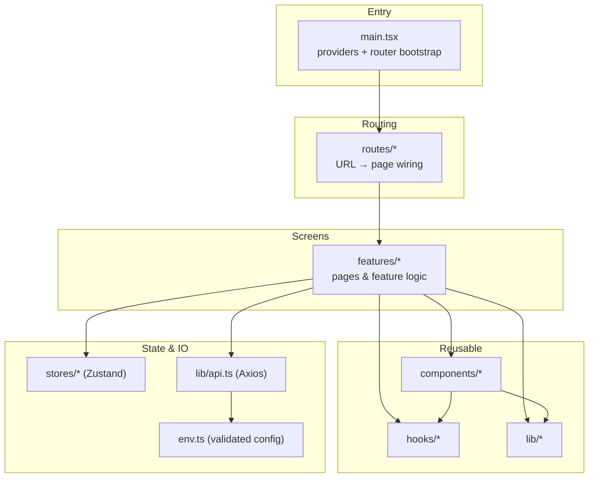
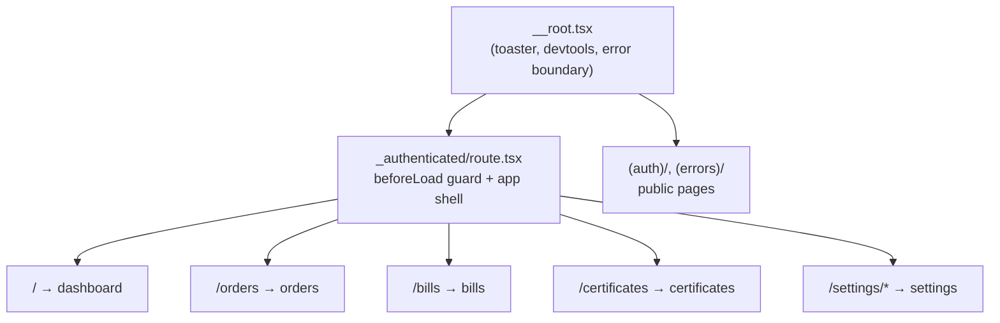
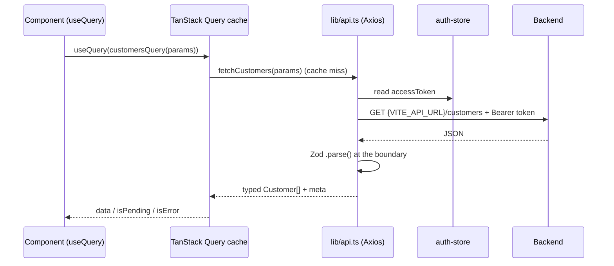
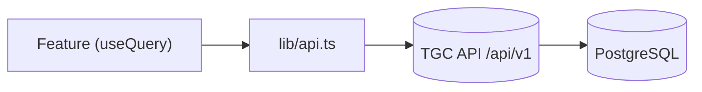

# Architecture

> Detailed flowcharts of each flow described here live in
> [diagrams/](./diagrams/README.md).

How the project is organized, what each directory is for, and how the pieces
talk to each other.

## Layered overview

The app is organized in layers. Higher layers depend on lower ones, never the
reverse — a `lib/` utility never imports a `feature`, but a feature freely uses
`lib/`, `components/`, and `hooks/`.



## Directory map

```
src/
├── main.tsx              App entry: builds the QueryClient + Router, mounts providers
├── env.ts               Zod-validated environment variables (fail-fast at startup)
├── routeTree.gen.ts     AUTO-GENERATED route tree — never edit by hand
├── vite-env.d.ts        Vite type shims
├── tanstack-table.d.ts  Type augmentation for TanStack Table column metadata
│
├── assets/              Static SVG/TSX icons and logos
│   ├── brand-icons/       Social/brand logos (GitHub, Facebook) used by auth forms
│   └── custom/            App-specific icons (layout, theme, sidebar variants)
│
├── config/
│   └── app-config.ts     Central branding (name, description, url)
│
├── context/            React context providers, mounted globally in main.tsx / layout
│   ├── theme-provider.tsx      Light/dark/system theme
│   ├── font-provider.tsx       Font family selection
│   ├── direction-provider.tsx  LTR/RTL text direction
│   ├── layout-provider.tsx     Sidebar variant/collapse state
│   └── search-provider.tsx     Global command-menu (⌘K) search state
│
├── stores/
│   └── auth-store.ts     Zustand store for auth state (user + token, cookie-backed)
│
├── lib/                Framework-agnostic utilities and IO
│   ├── api.ts            Axios client: base URL, auth header, single-flight 401 refresh
│   ├── api-query.ts      Maps table state to the API's query-parameter contract
│   ├── authz.ts          RBAC helpers (`hasAnyPermission`, `requirePermission` guard)
│   ├── utils.ts          `cn()` classname merge, `sleep()`, misc helpers
│   ├── cookies.ts        Typed cookie get/set/remove
│   ├── format.ts         Locale/timezone/currency — the ONLY money+date formatter
│   ├── permissions.ts    The permission vocabulary and the `perm()` builder
│   ├── app-config-query.ts     Deployment flags fetched from the API
│   ├── download.ts       Streams a file response to the browser
│   ├── handle-server-error.ts  Normalizes API errors into user-facing toasts
│   └── show-submitted-data.tsx Dev helper used by the unfinished settings forms
│
│
├── test-utils/         Helpers shared by tests
│
├── hooks/              Reusable React hooks
│   ├── use-mobile.tsx          Media-query hook for responsive behavior
│   ├── use-dialog-state.tsx    Open/close dialog state helper
│   └── use-table-url-state.ts  Syncs table paging/filters to the URL
│
├── components/         Shared UI components (used across ≥2 features)
│   ├── ui/               Base UI primitives (Button, Dialog, Table, …) — owned source, low-churn
│   ├── data-table/       data-table (the shared shell) · row-actions · column-header
│   │                     · pagination · view-options. Filters are passed to
│   │                     <DataTable> as a `toolbar` prop, not a component.
│   ├── layout/           App shell: sidebar, header, nav, and the authenticated layout
│   │   ├── authenticated-layout.tsx  Sidebar + header frame + error boundary around <Outlet>
│   │   ├── app-sidebar.tsx           Assembles the sidebar from sidebar-data
│   │   ├── app-title.tsx             Crest + wordmark (reads app-config)
│   │   ├── header.tsx / main.tsx     Content region primitives
│   │   ├── breadcrumbs.tsx           The header trail, derived from the URL
│   │   ├── back-button.tsx           History back, disabled at the root
│   │   ├── nav-group.tsx / nav-user.tsx  Sidebar nav rendering
│   │   └── data/                     sidebar-data.ts (the navigation model),
│   │                                 filter-nav.ts (permission filtering) and
│   │                                 breadcrumbs.ts (URL → trail)
│   └── *.tsx             Cross-feature widgets. The load-bearing ones:
│                           can.tsx                 permission gate for UI
│                           dialog-body.tsx         scrollable dialog region
│                           status-badge.tsx        status tones, and the factory
│                                                   every feature's badge is built on
│                           page-heading.tsx        a screen's title + description
│                           view-footer-actions.tsx row actions in a view dialog
│                           user-menu-content.tsx   shared by both user menus
│                           kbd.tsx                 platform-correct shortcut hints
│                           bool-badge.tsx · confirm-dialog.tsx · definition-list.tsx
│                           command-menu.tsx · date-picker.tsx · long-text.tsx
│                           password-input.tsx · theme-switch.tsx · search.tsx
│
├── features/           One folder per feature/screen (the bulk of the app)
│   ├── auth/             Sign-in page, form and the auth data layer
│   ├── audit-logs/       The activity log: table, filters, diff renderer
│   ├── dashboard/        Landing dashboard — the day's counts across the pipeline
│   ├── customers/        The people who bring stones in
│   ├── orders/           An intake of stones, and the stones on it
│   ├── stones/           Every stone in the lab, across all orders
│   ├── identification/   Findings recorded against an identified stone
│   ├── identification-queue/  The identification screen's table
│   ├── bills/            Bills, control numbers and payment simulation
│   ├── payments/         Payments received against bills
│   ├── certificates/     Issuing, revoking and downloading certificates
│   ├── worklists/        ONE screen serving all four pipeline queues
│   ├── roles/            RBAC admin: roles and the permission matrix
│   ├── users/            Accounts, avatars and role assignment
│   ├── lookups/          ONE screen serving all ten reference tables
│   ├── system-logs/      Read-only view over the API's own log files
│   ├── settings/         Profile / account / appearance / notifications / display
│   └── errors/           Error pages (401/403/404/500/503) — also reused as boundaries
│
├── routes/             File-based routes (TanStack Router). Structure = URL structure.
│   ├── __root.tsx         Root layout: devtools, toaster, error + not-found boundaries
│   ├── (auth)/            Route group for public auth pages (parentheses = no URL segment)
│   ├── (errors)/          Route group for standalone error routes
│   └── _authenticated/    Layout route: guards every child, renders the app shell
│       ├── customers/ · orders/ · stones/ · identification/
│       ├── identification-reports/ · bills/ · payments/ · certificates/
│       ├── users/ · roles/ · settings/ · audit-logs/ · system-logs/
│       ├── lookups/$slug/     One screen, ten URLs
│       └── worklists/$slug/   One screen, four URLs
│
└── styles/
    ├── index.css          Tailwind v4 entry — imports theme.css, plus base rules
    └── theme.css          Every design token, light and dark
```

## The two folders people confuse: `features/` vs `components/`

| | `features/` | `components/` |
| --- | --- | --- |
| **Contains** | Whole screens and their logic | Reusable pieces |
| **Reused across features?** | No — feature-specific | Yes — that's the point |
| **Example** | `features/orders/` (the Orders page) | `components/ui/table.tsx` (a table) |

Rule of thumb: **build inside a feature first**. Only promote something to
`components/` once a *second* feature needs it.

## `features/*` internal convention

Every feature follows the same shape, so any feature is predictable to open:

```
features/<name>/
├── index.tsx        The page component (composes header + content)
├── components/       Components used only by this feature
└── data/             Zod schemas, types and API calls
```

`features/customers/` is the canonical example — the same shape as every other
feature, with the least domain detail in the way. See
[adding-a-feature.md](./adding-a-feature.md).

## Navigation structure

`sidebar-data.ts` holds six groups. The middle four follow the stone's journey
through the lab; the outer two are the same in any admin app:

```
Overview        Dashboard                              ← what staff open first
Operations      Customers · Orders                     ← ─┐
Gemmology Lab   Identification queue · Identification  │
                Stones · Findings queue · Findings      │ the stone's journey,
Billing         Ready to bill · Bills · Payments        │ in the order it happens
Certificates    Certification queue · Certificates    ← ─┘
Administration  Users · Logs · Reference data           ← same in every project
```

Each pipeline group opens with its **queue** — the list of work waiting to enter
that stage — followed by the screens where the work is done. A queue is an entry
in `features/worklists/data/config.ts` rendered at `/worklists/<slug>`, so the
four queues share one screen. They sit inside their stage's group rather than
collected together, because the question a gemmologist asks is "what is waiting
for me", not "what queues exist".

**Reference data** is a collapsible generated from
`features/lookups/data/config.ts`, so adding a lookup table is one config entry
rather than an entry in two places. It sits under Administration because it is
maintained, not worked.

Two invariants make the structure hold itself together:

- Every entry declares the `permission` the API enforces for that resource.
  `filterNavGroups` hides unreachable entries, drops a collapsible once all its
  children are hidden, and drops a group once it is empty — so a heading only
  appears for someone who has something under it. A receptionist sees a
  genuinely smaller sidebar, not a full one with dead links.
- Gate on the **item**, never the group: `NavGroup` carries no `permission`
  field and `filterNavGroups` would not read one. The `core.module_*` gates the
  API seeds exist to switch whole areas off, but the sidebar deliberately does
  not read them — a group disappears because every item under it is
  unreachable, which is one rule rather than two that can disagree.

The sidebar is one of the per-project swap points listed in
[customizing.md](./customizing.md).

## Table conventions

Most screens render `<DataTable>` — customers, orders, stones, identification,
findings, bills, payments, certificates, worklists, users, lookups, audit logs
and system logs — and they behave identically because they share the same
pieces:

```
components/data-table/data-table.tsx    server-driven table shell
  ├── row click ────────────────────►   opens the record's read-only view
  └── components/data-table/row-actions.tsx
          actions declared as data: View · Edit · the workflow verb · Restore · Delete
          rendered inline in the cell, and again in the view dialog's footer

the record's own mutate dialog        the read-only view, via `readOnly`
```

> **Roles is the exception.** `features/roles/index.tsx` hand-rolls its table
> from the raw `ui/table` primitives: it has no serial column, no *Show deleted*
> toggle and no server pagination, because there are only ever a handful of
> roles. It does borrow `DataTableRowActions`. Worth knowing before you copy it.

Four rules keep screens from drifting. The shell provides the machinery for
all four; the first is a convention it does not enforce.

1. **Six columns, no more:** a serial number (injected by the table, derived
   from server pagination so it keeps counting across pages), four data
   columns, and the actions menu. Anything else lives in the record's view.
2. **Rows are clickable** and open the record's **edit form in read-only
   mode** — the same dialog, wrapped in a disabled `<fieldset>`, with Save
   swapped for Edit. A record therefore reads exactly as it edits. Gated on
   `<resource>.view`. Clicks landing on a button, link, or menu item are
   ignored, so the actions menu never opens a sheet behind itself.
3. **Actions are declared, not hand-written.** Each table returns a
   `RowAction[]`, rendered as inline icon buttons in the cell and as labelled
   buttons in the record's view dialog. Permission filtering happens once, in
   the shared renderer.
4. **Deletes are soft.** Every *soft-deletable* table has a *Show deleted*
   toggle (sending `with_trashed`), deleted rows render with a red tint and
   start-edge marker plus a badge, and Restore replaces Delete in their menu.
   Audit logs and system logs are append-only and roles have no soft deletes,
   so those three have no toggle. There is no force delete anywhere in the
   stack — not in the UI, the API, or the permission set.

The full reference, with code, is in **[conventions.md](./conventions.md)**.

The ten lookup screens — stone categories, stone types, species, varieties,
colours, origins, shapes and cuts, instruments, user statuses and genders —
share **one** feature, `features/lookups/`, parameterised by `data/config.ts`.
Adding an eleventh means adding a config entry, not a new feature folder. The
four pipeline queues work the same way through `features/worklists/`.

## Formatting and localisation

`src/lib/format.ts` is the only place money and dates are formatted. Every
other call site imports from it, because a bare `toLocaleString()` follows the
*viewer's* browser locale — the same record would read differently on two
machines. Locale (`en-TZ`), timezone (`Africa/Dar_es_Salaam`) and default
currency (`TZS`) are what you change to relocate the app — see
[customizing.md](./customizing.md).

The app is **single-currency**. The API keeps a per-record `currency` column
and validates only that it is three characters, but the UI neither offers a
picker nor renders anything but `DEFAULT_CURRENCY` — a picker invites data the
app has no way to convert or total correctly. Widening to multi-currency means
adding the picker back *and* deciding what a mixed-currency total means.

Keyboard hints go through `src/components/kbd.tsx`, which resolves the platform
once and renders `Ctrl` rather than `⌘` off Apple hardware.

## The audit trail

Every write the API performs is recorded, and **Audit Logs** is where it is
read:

```
        features/audit-logs/index.tsx
          "/audit-logs" — every recorded write, filterable by event and
          date, with a per-entry diff (field · before · after)
```

Reading the log needs `auditlog.view_logentry`, granted only to `superadmin` and
`manager`. There are no write endpoints — the log is append-only.

Record history is deliberately **not** duplicated onto individual rows. One
screen that can answer "what happened to this record" alongside "what happened
today" is easier to keep correct than a timeline component threaded through
every feature. Where a record's own trail genuinely matters to the work — a
stone moving through the lab — the feature shows it in place: the stone details
dialog renders its status history inline.

The sidebar groups two views under **Logs**:

| View | Source |
| --- | --- |
| Audit Logs | The API's record of writes — filter by event (`created`, `updated`, `deleted`, `accessed`). Sign-ins, failed passwords and role syncs are not audit entries; they are written to the system log |
| System Logs | A separate read-only API over the server's own log files, with bounded reads and credential redaction |

## How routing works

TanStack Router is **file-based**: the shape of `src/routes/` becomes the URL
shape, and the plugin compiles it into `routeTree.gen.ts` (auto-generated —
never edit it; it regenerates whenever Vite runs).



Key conventions:

- **`_authenticated`** (leading underscore) is a *pathless layout route*: it adds
  no URL segment but wraps all children with the auth guard + sidebar shell.
- **`(auth)`, `(errors)`** (parentheses) are *route groups*: they organize files
  without adding a URL segment.
- A route file is intentionally thin — it validates search params and points at a
  feature component. All real UI lives in `features/`.

## How data flows (fetching)

`features/customers/` shows the full path from config to pixels:



- **`env.ts`** provides the base URL, validated at startup.
- **`lib/api.ts`** attaches the auth token and handles 401 refresh centrally.
- **TanStack Query** owns server state (caching, loading/error flags, refetch).
- **Zod** validates the response so bad data fails at the boundary, not deep in
  the UI.

Global error handling for queries/mutations (401 → sign-out, 500 → toast) lives
in the `QueryClient` config in [`main.tsx`](../src/main.tsx).

### Where the data actually comes from

Every feature goes through the shared `api` client, which points at the Django
API via `VITE_API_URL` (the base URL includes the version segment, so feature
code uses clean paths like `/orders`).



Lists are **paginated by the server**, and every collection comes back in the
same envelope:

```json
{ "count": 137, "next": "…?page=3", "previous": "…?page=1", "results": [ … ] }
```

`lib/api-query.ts` owns both sides of that contract. It translates table state
into query parameters — `page`, `page_size`, `search`, `ordering`, plus
`with_trashed` / `only_trashed` — and normalises the envelope back into
`{ items, meta }` for the table components, **synthesising** `meta` (current
page, last page, total) from `count` and the requested page size, since the API
does not send page numbers. Sorting is a single `ordering` parameter with a
leading `-` for descending, not a field/direction pair. Empty values are
omitted rather than sent blank, so the API never sees `""` as a real filter.

Tables run with TanStack Table's `manual*` flags, so the browser never
re-filters a partial dataset.

### Token refresh

`lib/api.ts` retries a request once after refreshing on a 401. Concurrent
failures share a **single in-flight refresh promise**, so five parallel requests
trigger one refresh instead of five (which would invalidate each other). Swap
`refreshAccessToken()` for your provider's call.

### Authorization (RBAC)

Gates are expressed as **permissions** — they arrive with `/auth/me` and live
on `auth.user.permissions` in the auth store. Three tools consume that one
list:

| Tool | Use for | Example |
| --- | --- | --- |
| `requirePermission([...])` from `lib/authz.ts` | Guarding a whole route | `beforeLoad: requirePermission([perm('orders', 'view')])` |
| `<Can permission={perm('orders', 'add')}>` from `components/can.tsx` | Hiding UI actions | Wrap the "Create order" button |
| `filterNavGroups()` in `layout/data/filter-nav.ts` | Sidebar + command palette | Hides unreachable pages |

One more read of the same navigation model, which deliberately does **not**
consume permissions:

| Tool | Use for | Example |
| --- | --- | --- |
| `resolveBreadcrumbs()` in `layout/data/breadcrumbs.ts` | The header trail | `/lookups/colors` → `Home › Administration › Reference data › Colours` |

It reads `sidebarData` **unfiltered**: `filterNavGroups` drops a whole group
once the user can see none of its items, so filtering the trail too would punch
holes in the path of a page the user can legitimately reach. Nothing leaks —
every ancestor crumb renders as plain text, never a link.

Permission names are built with `perm()` from `lib/permissions.ts`, which
resolves a resource and an action into the Django name the API enforces —
`perm('orders', 'view')` becomes `orders.view_order`. The actions are `view`,
`add`, `change` and `delete`; there is deliberately no separate "view any",
because the API does not distinguish one. Workflow verbs that are not CRUD
(`orders.hold_order`, `certificates.issue_certificate`) are named in full.

Permissions rather than roles, because that is exactly how the API enforces
access — a role gate would drift the moment someone edited that role from the
Roles screen.

Hiding UI is usability, **not security** — the API enforces every one of these
independently.

## State: where does it live?

| Kind of state | Home | Example |
| --- | --- | --- |
| Server data | TanStack Query | Orders list, bills |
| Global client state | Zustand (`stores/`) | Auth user + token |
| UI/preference state | React context (`context/`) | Theme, font, sidebar |
| Local component state | `useState` in the component | A dialog's open flag |
| URL state | Route search params | Table page/filter (`use-table-url-state`) |

## The swap points

The swap points — branding, environment, API, auth, navigation, reference data,
theme, localisation and permissions — are enumerated in
**[customizing.md](./customizing.md)**.

They live in one file on purpose: listing them in three places produces three
different counts.
