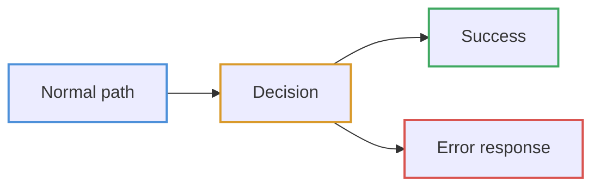

# Diagrams

Request and data flows through the app, drawn from the code rather than from
intent. Every diagram is Mermaid, so GitHub, VS Code and most Markdown viewers
render them without a build step.

| Diagram | Answers |
| --- | --- |
| [App bootstrap](app-bootstrap.md) | What `main.tsx` wires up, and in what order |
| [Route guards](route-guards.md) | How a URL is gated before a page renders |
| [Authentication](authentication.md) | Sign-in, cookie persistence, rehydration, token refresh |
| [Data fetching](data-fetching.md) | How a component gets server data, and when it refetches |
| [List and table flow](list-table-flow.md) | URL search params to API query params and back |
| [Mutations](mutations.md) | Form submit to cache invalidation, including 422 handling |
| [Error handling](error-handling.md) | Every failure path and where it surfaces |

For the higher-level picture — folder layout, layering, state ownership — see
[architecture.md](../architecture.md). These diagrams zoom into the flows that
document describes in prose.

## Reading these

Boxes name real modules. Where a box says `src/lib/api.ts`, that file exists and
does what the box claims — if you change one, change the other.

Meaning is carried by the **border** colour, never by a fill. Backgrounds and
text are left to the viewer's theme, so every node matches the surrounding page
— dark in a dark IDE, light on GitHub — instead of a light box floating on a
dark background.

| Border | Meaning |
| --- | --- |
| Blue | Entry point or normal path |
| Amber | Decision |
| Green | Success |
| Red | Error or failure |

