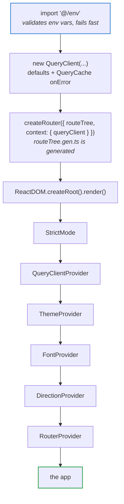
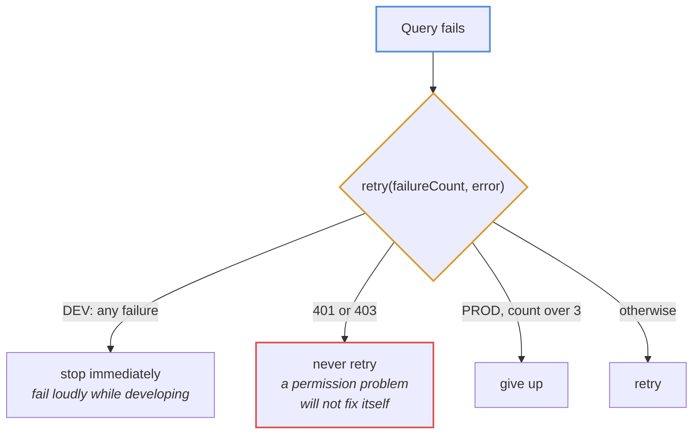
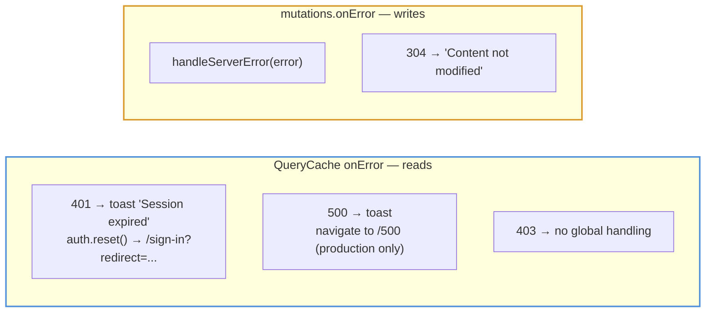

# App bootstrap

Everything `src/main.tsx` sets up before the first pixel renders.

## Provider tree

The router is created with `context: { queryClient }`, which is what lets a
route's `beforeLoad` call `context.queryClient.ensureQueryData(...)` — that is
how the auth guard fetches the current user before rendering.

`import '@/env'` runs first on purpose: a missing `VITE_API_URL` should stop the
app at startup with a clear message, not surface later as a request to
`undefined/products`.

## QueryClient defaults

| Default | Value | Why |
| --- | --- | --- |
| `staleTime` | 10s | Cached data is reused for 10 seconds before a background refetch |
| `refetchOnWindowFocus` | production only | Refetching on every alt-tab is noise while developing |
| `retry` | custom | Never retries 401 or 403; no retries at all in dev |

## Global error wiring

Two separate hooks, and the split matters:

A failed **read** is usually a session or server problem, so it is handled
globally. A failed **write** usually needs to be shown next to the form that
caused it, so the global handler only produces a toast and leaves the specific
handling to the mutation — see [mutations.md](mutations.md).

The 500 redirect is guarded by `import.meta.env.PROD` so a server restart during
development does not throw you off the page you are working on.
