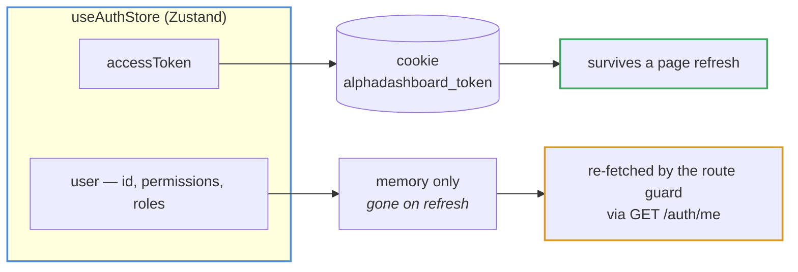
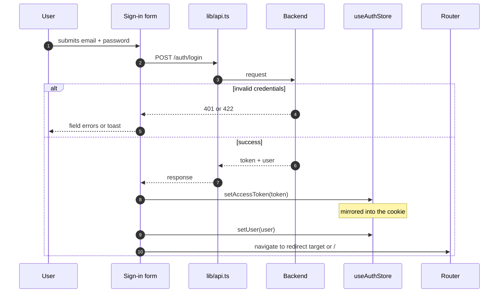
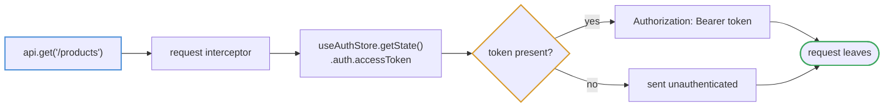
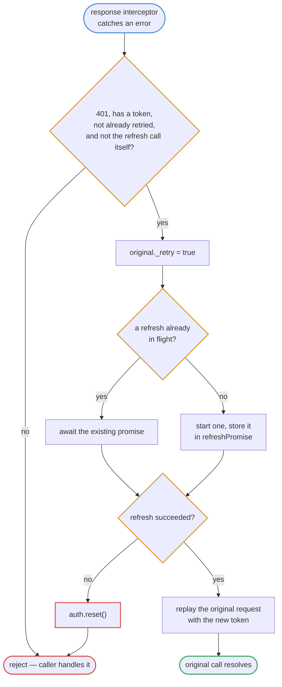
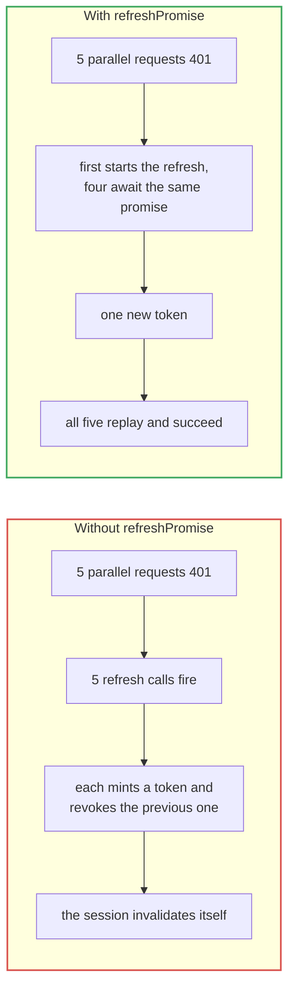
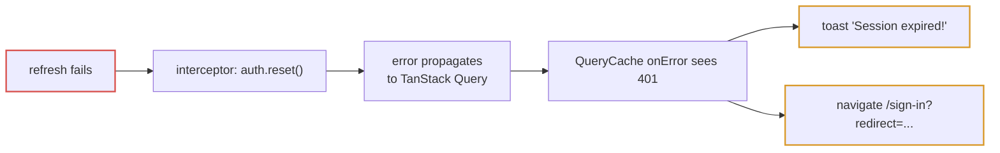

# Authentication

Bearer token in a cookie, user object in memory, refresh handled transparently
by an Axios interceptor.

## Where the session lives

Read `auth.user` expecting `null`. A component that assumes a user is present
will crash on a hard refresh — the guard fills it in, but only for routes under
`_authenticated`.

## Sign-in

## Attaching the token

The interceptor reads the store with `getState()` rather than a hook, so the
current token is picked up per request without the module subscribing to React.

## Refresh on 401

### The shared promise

Three conditions guard the retry, and each prevents a specific loop:

| Guard | Prevents |
| --- | --- |
| `!original._retry` | Retrying forever when the new token is also rejected |
| `!isRefreshCall` | A dead session looping on `/auth/refresh` itself |
| `Boolean(accessToken)` | Trying to refresh when never signed in |

## Session expiry

When refresh fails, the interceptor resets the store and rejects. The toast and
redirect come from the `QueryCache` handler in `main.tsx`, not from here — the
interceptor's job is the token, not the user experience.

