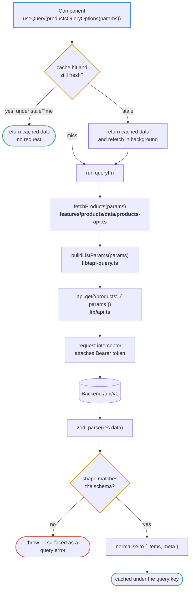
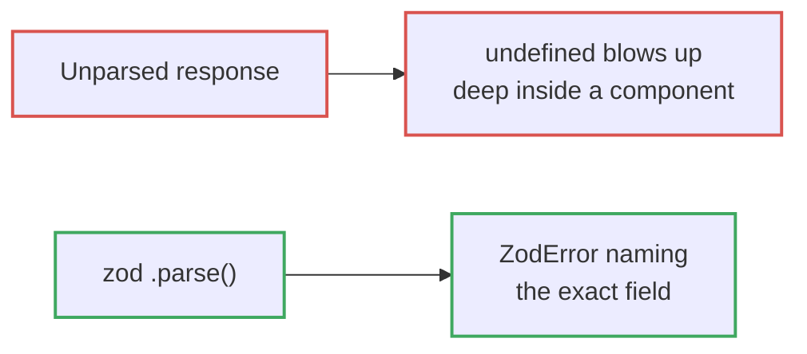
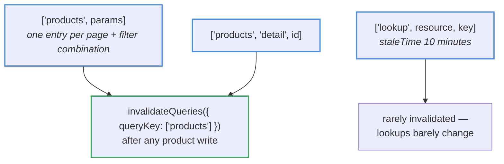
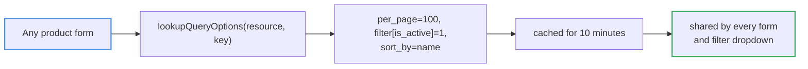
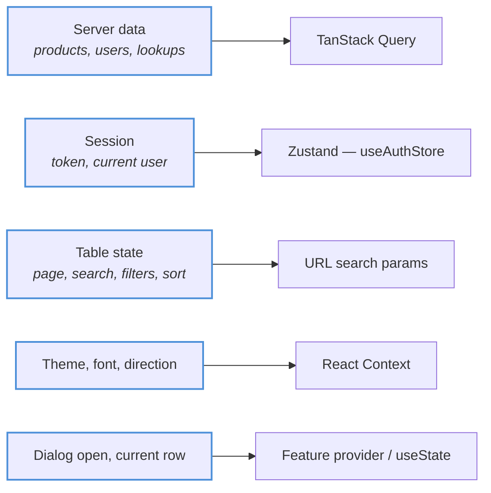

# Data fetching

Every read goes through TanStack Query. No feature calls `axios` directly, and
no feature keeps server data in `useState`.

## The path

## Validating at the boundary

`zod` parses every response before it reaches a component. That converts a
backend contract change from a mystery — `undefined is not an object`, three
components deep, on a user's machine — into a loud, specific failure at the
network boundary with the offending field named.

## Query keys and caching

Because `params` is part of the key, every page and filter combination caches
separately — paging back to page 1 is instant. The prefix `['products']` covers
both list and detail entries, so a single `invalidateQueries` after a write
refreshes everything that could have changed.

`placeholderData: (previous) => previous` keeps the previous page on screen
while the next loads, instead of collapsing to a skeleton on every keystroke.

## Lookups

Categories, brands, statuses, units and tags are small and change rarely, so
they are fetched once at a large page size and reused for the session rather
than refetched per dialog.

## Where each kind of state belongs

Server data never gets copied into `useState`. The moment it does, there are two
sources of truth and one of them is wrong.
