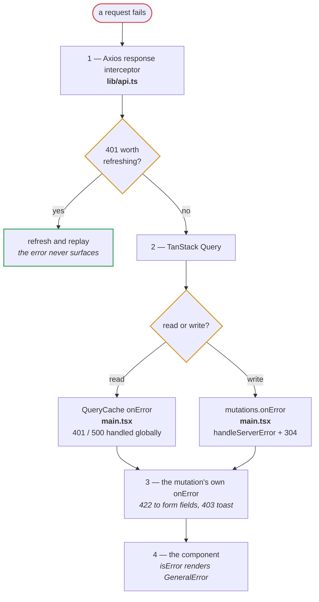
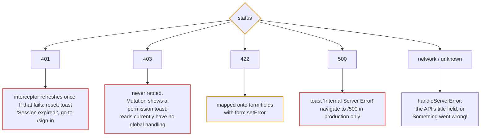
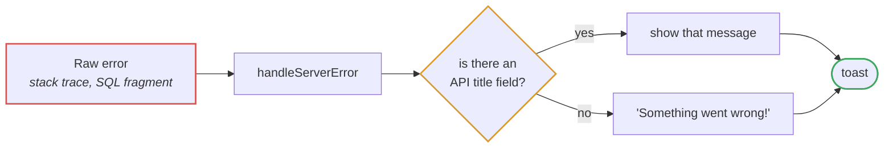
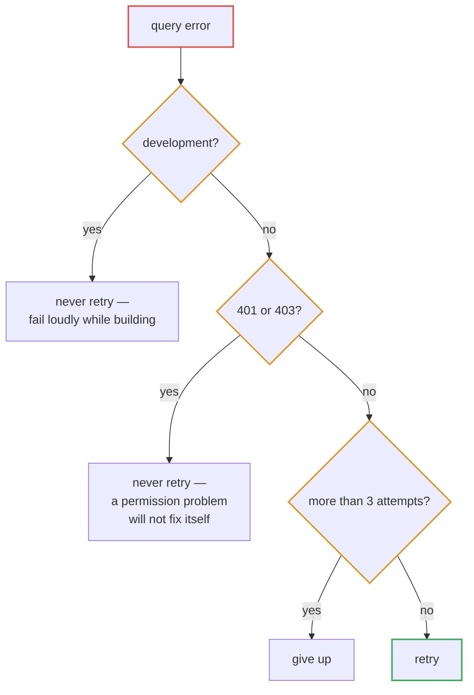

# Error handling

Failures are handled at four levels. Each catches what the one below it should
not have to know about.

## The layers

## By status code

## What the user is allowed to see

A raw exception never reaches the screen. Only a message the API deliberately
supplied, or a generic fallback.

In development the original error is also logged to the console, so the detail
is available to whoever needs it without being shown to the user.

## The retry policy

Retrying a 401 or 403 is pointless: the answer will be the same, and it turns
one denied request into four.

## Where a failure surfaces

| Failure | Where the user sees it |
| --- | --- |
| Expired session | Toast, then the sign-in page |
| Missing permission on a route | Redirect to `/403` |
| Missing permission on an action | Toast, control usually hidden already |
| Form validation | Inline, next to the field |
| List request failed | `GeneralError` in place of the table |
| Server error | Toast, and `/500` in production |
| Response failed schema validation | Query error — the table shows `GeneralError` |

That last row is worth knowing: a backend contract change surfaces the same way
a server outage does, because `zod.parse` throws inside the query function.
