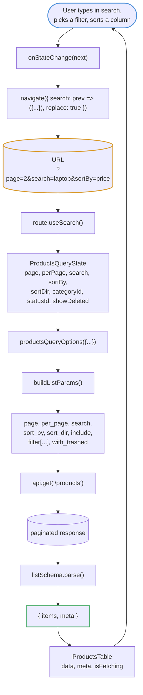
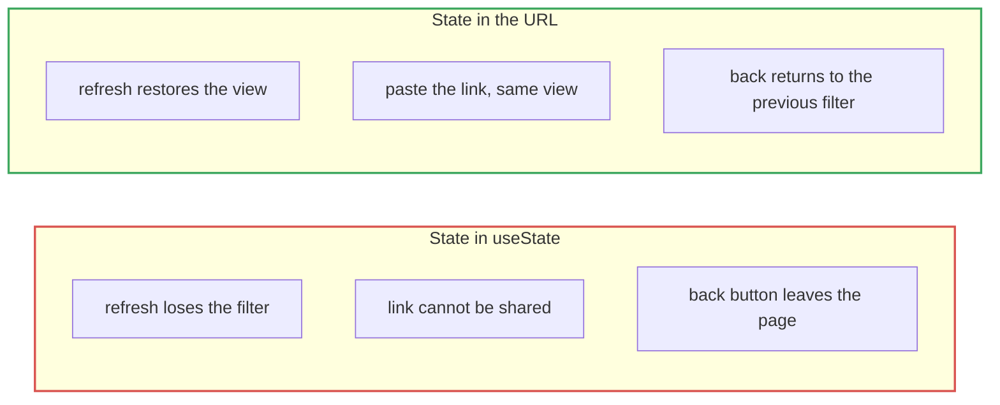
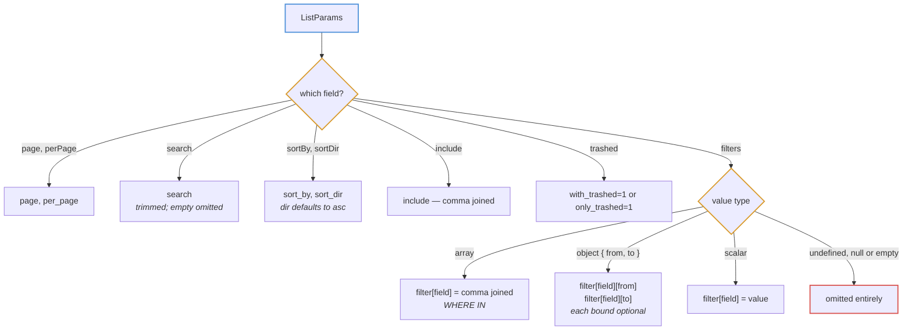
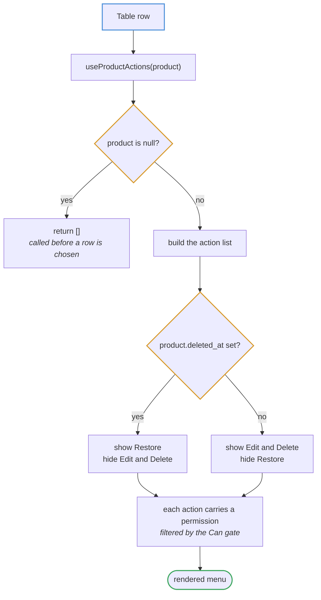

# List and table flow

Table state lives in the URL, not in component state. A filtered view is
therefore shareable, survives a refresh, and works with the back button.

## Round trip

`replace: true` on the navigation means typing in the search box does not push
a history entry per keystroke — otherwise the back button would walk backwards
through every character typed.

## Why the URL owns table state

## Parameter translation

`buildListParams` in `src/lib/api-query.ts` is the only place that knows the
API's query-string contract. The bracket syntax and comma joining are easy to
get subtly wrong, so no feature builds these by hand.

Empty values are omitted rather than sent blank. Sending `search=` would have
the API treat the empty string as a real filter and return nothing.

## Row actions

The action list is a hook, not a component, so the row menu and the record's
view dialog render the same list. Two hand-maintained copies would drift, and
the drift would be silent — a button available in one place and missing in the
other.

The hook is called unconditionally with a possibly-null product, because hooks
cannot be conditional. Returning `[]` for null is what makes that safe.
