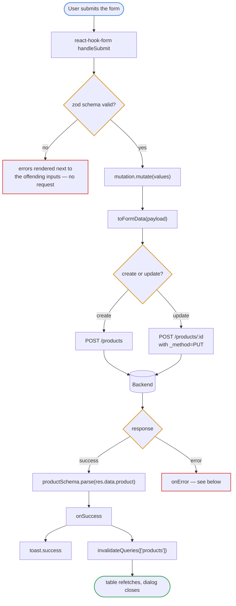
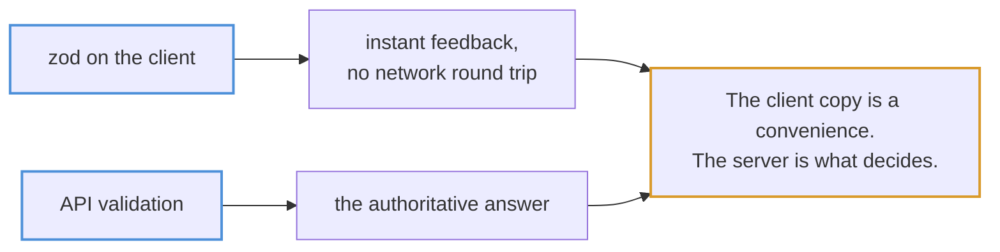
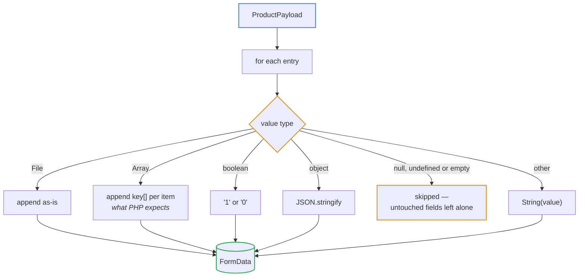
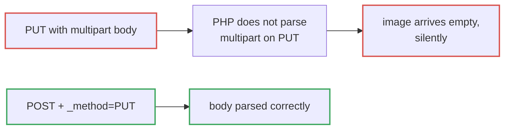
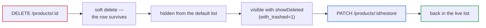

# Mutations

Every write goes through `useMutation`, and every write ends by invalidating the
queries it could have changed.

## Submit to refresh

## Two layers of validation

## Error routing

The mutation's own `onError` handles what belongs on the form; anything else
falls through to the global handler.

**422 must not reach `handleServerError`.** A validation failure belongs beside
the input that caused it, not in a toast that vanishes while the user is still
looking for the bad field. That is why the mutation intercepts it before the
global handler ever sees it.

## Multipart writes

Products can carry an image, so every write is multipart rather than JSON.

### Method spoofing

This one is worth remembering because it fails quietly: the request succeeds,
the record updates, and only the file is missing.

## Delete and restore

Deletes are soft everywhere in this app, which is why the table has a "show
deleted" toggle and rows carry a Restore action rather than a delete being
final.
