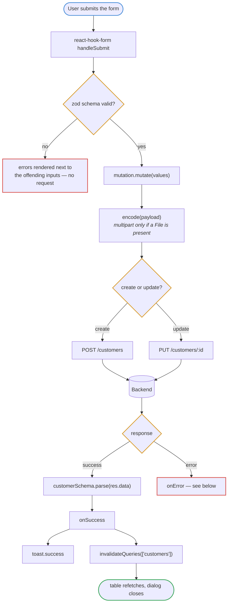
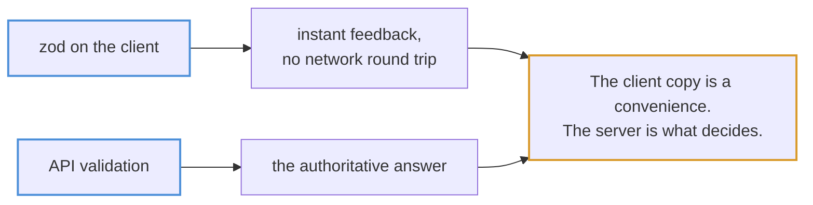
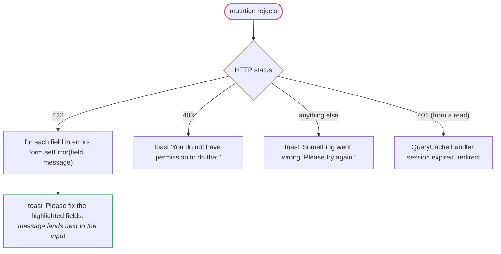
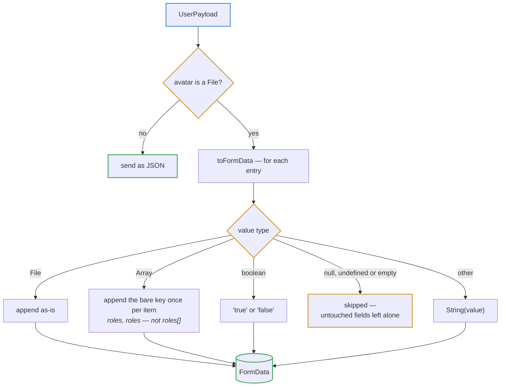
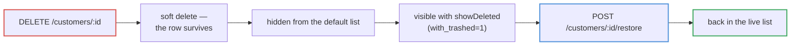

# Mutations

Every write goes through `useMutation`, and every write ends by invalidating the
queries it could have changed.

## Submit to refresh

## Two layers of validation

## Error routing

The mutation's own `onError` handles what belongs on the form; anything else
falls through to the global handler.

**422 must not reach `handleServerError`.** A validation failure belongs beside
the input that caused it, not in a toast that vanishes while the user is still
looking for the bad field. That is why the mutation intercepts it before the
global handler ever sees it.

## Multipart writes

Most writes are plain JSON. Only a write that actually carries a file is
encoded as multipart — `encode()` in `features/users/data/api.ts` checks for a
`File` and falls back to the payload untouched:

Two details are easy to get wrong:

- **Arrays use a repeated bare key.** `roles`, `roles` — not `roles[]`, which
  would arrive as one field literally named `roles[]` and be ignored.
- **JSON is the default on purpose.** Multipart flattens every value to a
  string, so a `null` that should clear a field and a number that should stay a
  number both arrive as text. The heavier encoding is used only where a file
  genuinely requires it.

## Delete and restore

Deletes are soft everywhere in this app, which is why the table has a "show
deleted" toggle and rows carry a Restore action rather than a delete being
final.
