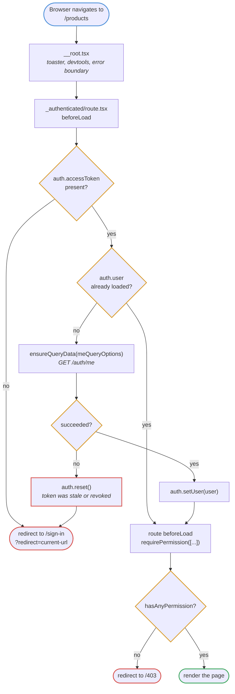
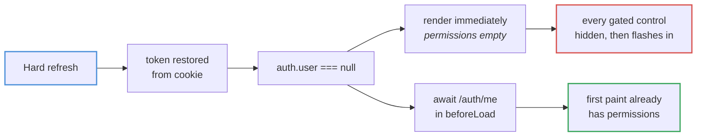
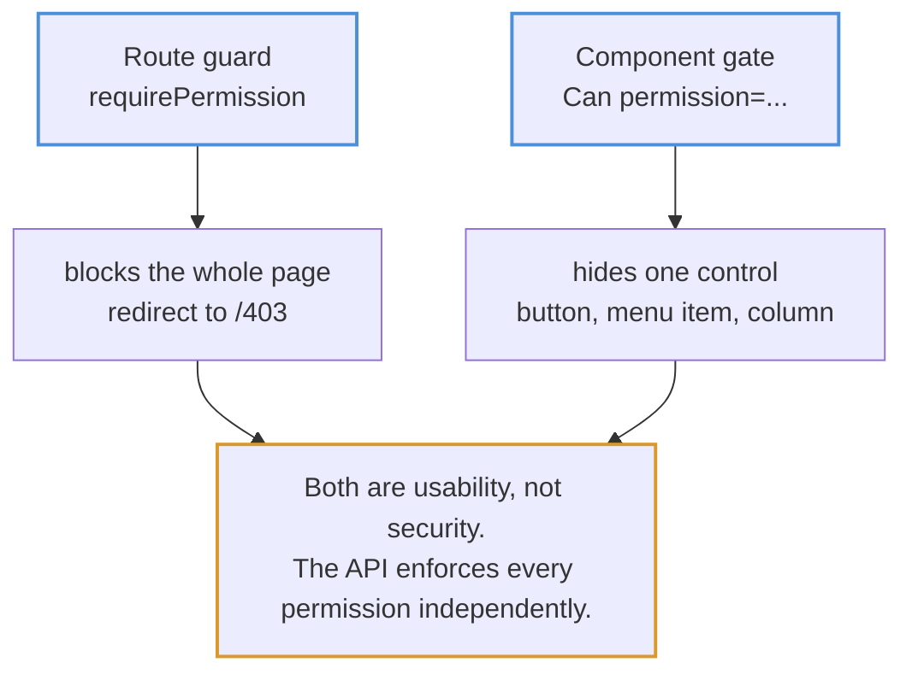

# Route guards

TanStack Router runs `beforeLoad` on every matching route in the tree, parent
first, before the component renders. Two guards stack.

## The chain



## Why the `me` call blocks rendering

The token is persisted in a cookie; **the user object is not**. After a hard
refresh the store has a token but no user — and permissions live on the user.



This is why `beforeLoad` awaits rather than firing the request and rendering
optimistically: the alternative is a visible flash of a stripped-down UI on
every refresh.

## Declaring a permission on a route

```
export const Route = createFileRoute('/_authenticated/products/')({
  beforeLoad: requirePermission(['products.viewAny']),
  component: Products,
})
```

`requirePermission` lives in `src/lib/authz.ts`. It gates on **permissions**,
never roles — the API enforces permissions, so using the same vocabulary means
UI and server cannot disagree. A role gate would drift the moment someone edits
that role from the Roles screen.

## Two layers of gating



Hiding a button stops an honest user from hitting a wall; it stops nobody from
calling the endpoint. The server is the only thing enforcing access.
