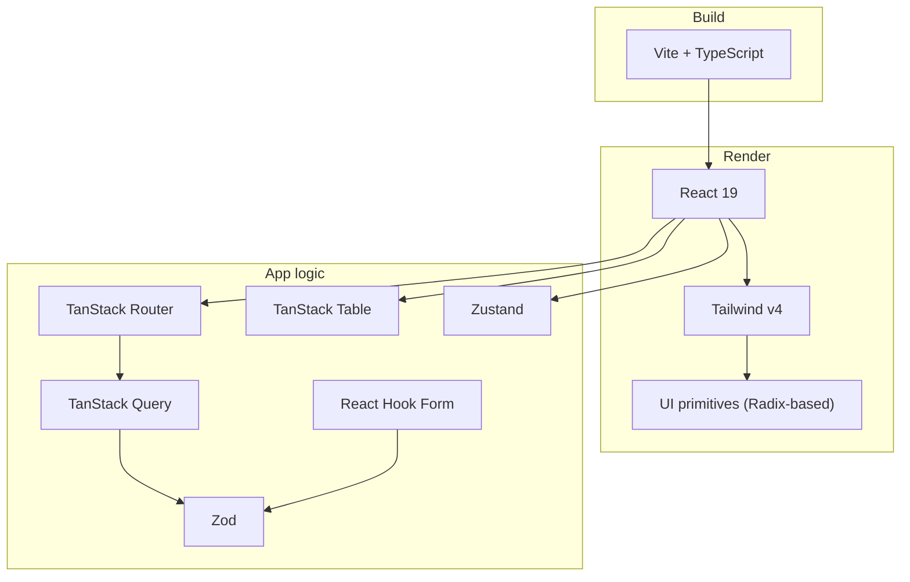
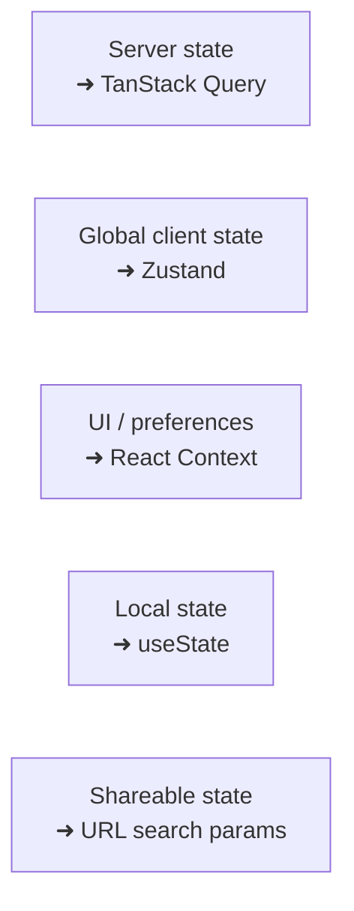

# Tech Stack & Rationale

Every library in the template and *why* it's here. The theme throughout:
**typed, composable, and file-based** — tools that catch mistakes at compile time
and stay out of your way at runtime.

## How the core pieces fit

## Build & language

| Tool | Why it's here | Trade-off / alternative |
| --- | --- | --- |
| **Vite** | Near-instant dev server (native ESM) and fast builds. Rich plugin API used for routing, Tailwind, and HTML branding injection. | vs. Next.js: Vite is a pure SPA build — no SSR/RSC. Chosen because this is a client-rendered admin app. |
| **TypeScript** | Types are the safety net for a *reusable* template — refactors and new features fail at compile time, not in production. | Slightly more upfront ceremony; worth it at any real scale. |

## UI layer

| Tool | Why it's here |
| --- | --- |
| **React 19** | The ecosystem baseline; everything else assumes it. |
| **Tailwind CSS v4** | Utility-first styling keeps styles co-located with markup and avoids a growing pile of dead CSS. v4 is config-light (CSS-based tokens in `styles/index.css`). |
| **UI primitives** | **Not a dependency — copied source** in `components/ui/`. You *own* these components and can edit them freely. Built on Radix. |
| **Radix UI** | Unstyled, accessible primitives (focus traps, ARIA, keyboard nav) underneath them. Accessibility is hard to retrofit — this bakes it in. |
| **lucide-react** | Consistent, tree-shakeable icon set. |
| **Recharts** | Declarative, composable charts for the dashboard. |

> **Why "own the source" matters for a template:** you aren't locked
> to a component library's API. Each project can tweak primitives without forking
> a dependency.

## Routing & data

This is the TanStack layer — the app's backbone.

| Tool | Why it's here | Trade-off |
| --- | --- | --- |
| **TanStack Router** | Type-safe, file-based routing. URLs, params, and search are fully typed — you can't link to a route that doesn't exist. Loaders integrate with Query for prefetching. | Newer than React Router; smaller community. The type-safety win is the reason. |
| **TanStack Query** | Owns *server state*: caching, deduping, background refetch, and loading/error flags. Removes hand-rolled `useEffect` fetching. | A learning curve around cache keys/invalidation. |
| **TanStack Table** | Headless table engine (sorting/filtering/pagination logic) with zero imposed markup — you render with your own `Table`. | Verbose column defs; the flip side of full control. |
| **Axios** | HTTP client with interceptors (auth token, single-flight 401 refresh) — the natural place to attach auth tokens and centralize error/refresh handling (`lib/api.ts`). | vs. `fetch`: Axios's interceptors + ergonomics justify the dependency. |
| **Zod** | Runtime schema validation. Validates API responses at the boundary and powers form validation — and infers TypeScript types, so schema and type never drift. | Small runtime cost; pays for itself in safety. |

## State & forms

| Tool | Why it's here |
| --- | --- |
| **Zustand** | Minimal global *client* state (auth). Tiny API, no boilerplate/providers. We deliberately keep global state small — server state belongs to Query, not Zustand. |
| **React Hook Form** | Performant forms (uncontrolled inputs = fewer re-renders), with a first-class Zod resolver. |

### The state division of labor

Keeping these separate is the single most important architectural habit — it
prevents the "one giant global store" anti-pattern.

## Utilities

| Tool | Why it's here |
| --- | --- |
| **sonner** | Toast notifications (used by the global error handlers). |
| **cmdk** | The ⌘K command palette. |
| **date-fns** | Lightweight, tree-shakeable date utilities. |
| **clsx + tailwind-merge** | Combined as `cn()` in `lib/utils.ts` to compose classNames without conflicting Tailwind classes. |

## Tooling & quality

| Tool | Why it's here |
| --- | --- |
| **ESLint + typescript-eslint** | Static analysis and consistent code style. |
| **Prettier** | Opinionated formatting (with import sorting + Tailwind class sorting plugins). |
| **knip** | Finds unused files, exports, and dependencies — keeps a reusable template from accumulating cruft. |
| **Vitest + Playwright** | Component/browser testing (Vitest browser mode drives a real Chromium via Playwright). |
| **husky + lint-staged** | Pre-commit hook runs ESLint + Prettier on staged files, so bad code never gets committed. |

## Package manager: pnpm

Uses **pnpm** (via corepack). It's faster and far more disk-efficient than npm
(a global content-addressable store + hard links instead of copying every
dependency into every project). Build scripts (e.g. `esbuild`) are approved in
`pnpm-workspace.yaml` — pnpm blocks install scripts by default for supply-chain
safety.

## What was deliberately left out

- **No SSR / meta-framework** — this is a client-rendered SPA. Add Next.js/Remix
  only if a project actually needs SSR or SEO.
- **No CSS-in-JS** — Tailwind covers styling; a runtime styling library would add
  cost for no gain here.
- **No global state library beyond Zustand** — Query + Zustand + context cover the
  needs without Redux-scale boilerplate.

## Also in `package.json`, less prominent

| Library | Where it shows up |
| --- | --- |
| `react-day-picker` | Backs `components/ui/calendar.tsx` and `components/date-picker.tsx` |
| `react-top-loading-bar` | The navigation progress bar in `components/navigation-progress.tsx` |
| `class-variance-authority` | Variant props on the UI primitives (`button`, `badge`, …) |
| `tw-animate-css` | Animation utilities used by Radix-driven transitions |

## A note on versions

This template tracks **aggressive majors** — TypeScript 6, Vite 8, ESLint 10,
Zod 4, Vitest 4, Tailwind 4. That is deliberate for a starting point: a new
project should begin on current tooling rather than inherit a migration.

The trade-off is real, though. Ecosystem plugins occasionally lag these
versions, and upgrade notes are thinner than for LTS-style stacks. If your
project needs a conservative dependency posture, pin the majors down before you
build on top rather than after.
